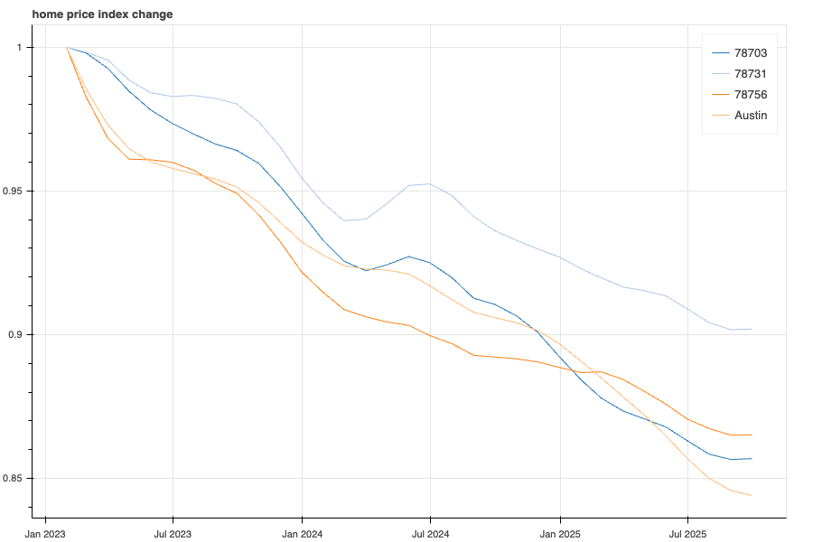

# 3904 Petes Path Valuation

_Updated: 2025-10-21_

---

## Neighborhood Comps

All homes sold on Petes Path, Idlewild, or Ridgelea since 2023.

| Date     | Last List Price | Sqft  | Price/Sqft | Address           | Bed | Bath | Build Year | Age at Sale | Lot Sqft | Tax Assessment | Shoal Creek Lot | Corner Lot | Pool |
| -------- | --------------- | ----- | ---------- | ----------------- | --- | ---- | ---------- | ----------- | -------- | -------------- | --------------- | ---------- | ---- |
| 4/12/23  | $1,500,000      | 3,293 | $456       | 3900 Petes Path   | 3   | 3    | 2003       | 20          | 9,064    | $1,319,148     | No              | Yes        | No   |
| 8/24/23  | $2,610,000      | 3,103 | $841       | 3905 Idlewild Rd  | 4   | 5    | 2023       | 0           | 7,753    | $2,468,157     | No              | No         | Yes  |
| 2/29/24  | $2,425,000      | 3,171 | $765       | 4000 Ridgelea Dr  | 4   | 4    | 2023       | 1           | 7,814    | $1,756,589     | No              | No         | Yes  |
| 3/1/24   | $785,000        | 1,353 | $580       | 3904 Ridgelea Dr  | 3   | 1.5  | 1949       | 75          | 7,840    | $725,522       | No              | No         | No   |
| 4/30/24  | $1,990,000      | 3,400 | $585       | 3900 Ridgelea Dr  | 6   | 5    | 2023       | 1           | 7,810    | $1,817,740     | No              | Yes        | Yes  |
| 5/15/24  | $1,699,000      | 3,122 | $544       | 4107 Idlewild Rd  | 4   | 3    | 2006       | 18          | 7,862    | $1,487,189     | No              | No         | No   |
| 12/4/24  | $895,000        | 2,148 | $417       | 4000 Idlewild Rd  | 4   | 2.5  | 1948       | 76          | 11,761   | $855,000       | No              | No         | No   |
| 4/7/25   | $1,595,000      | 2,296 | $695       | 4107 Jefferson St | 3   | 2    | 1948       | 77          | 10,646   | $849,515       | Yes             | No         | No   |
| 8/22/25  | $675,000        | 1,473 | $458       | 4012 Ridgelea Dr  | 2   | 2    | 1949       | 76          | 7,932    | $775,369       | No              | No         | No   |
| 10/10/25 | $2,400,000      | 2,794 | $859       | 4100 Ridgelea Dr  | 5   | 3.5  | 2021       | 4           | 7,666    | $1,545,426     | No              | No         | Yes  |

---

## Valuation Method A — Indexed Price + Adjustments

Assumptions:

1. Assume last list price as the effective sale price.
2. Adjust for 78731 index change from sale date to present.
3. Add the following price adjustment to make the home more comparable to 3904 Petes Path:
   1. For homes > 20 years old, assume a rebuild at 3k sqft and with a cost of $900k
   2. For > 10 years old, add $200k renovation cost
   3. For high-end custom new build sales, add $500k premium
   4. For shoal creek lot, add $200k premium

| Date     | Last List Price | Sqft  | Price/Sqft | Address           | Bed | Bath | Build Year | Age at Sale | 78731 Index Change | Indexed Price | Price Adjustment | Adj. Indexed Price | Adj. Indexed $/Sqft | Price Adjustment Note        |
| -------- | --------------- | ----- | ---------- | ----------------- | --- | ---- | ---------- | ----------- | ------------------ | ------------- | ---------------- | ------------------ | ------------------- | ---------------------------- |
| 4/12/23  | $1,500,000      | 3,293 | $456       | 3900 Petes Path   | 3   | 3    | 2003       | 20          | -9.4%              | $1,358,931    | $200,000         | $1,558,931         | $473                | Older at time of sale        |
| 8/24/23  | $2,610,000      | 3,103 | $841       | 3905 Idlewild Rd  | 4   | 5    | 2023       | 0           | -8.3%              | $2,394,199    | -$500,000        | $1,894,199         | $610                | High-end custom new build    |
| 2/29/24  | $2,425,000      | 3,171 | $765       | 4000 Ridgelea Dr  | 4   | 4    | 2023       | 1           | -4.0%              | $2,327,644    | -$500,000        | $1,827,644         | $576                | High-end custom new build    |
| 3/1/24   | $785,000        | 1,353 | $580       | 3904 Ridgelea Dr  | 3   | 1.5  | 1949       | 75          | -4.0%              | $753,485      | $900,000         | $1,653,485         | $551                | Rebuild                      |
| 4/30/24  | $1,990,000      | 3,400 | $585       | 3900 Ridgelea Dr  | 6   | 5    | 2023       | 1           | -4.6%              | $1,898,078    | $0               | $1,898,078         | $558                | 6bd new build, lower quality |
| 5/15/24  | $1,699,000      | 3,122 | $544       | 4107 Idlewild Rd  | 4   | 3    | 2006       | 18          | -4.6%              | $1,620,520    | $200,000         | $1,820,520         | $583                | Older at time of sale        |
| 12/4/24  | $895,000        | 2,148 | $417       | 4000 Idlewild Rd  | 4   | 2.5  | 1948       | 76          | -3.0%              | $868,183      | $900,000         | $1,768,183         | $589                | Rebuild                      |
| 4/7/25   | $1,595,000      | 2,296 | $695       | 4107 Jefferson St | 3   | 2    | 1948       | 77          | -1.6%              | $1,569,564    | -$200,000        | $1,369,564         | $597                | Shoal Creek premium          |
| 8/22/25  | $675,000        | 1,473 | $458       | 4012 Ridgelea Dr  | 2   | 2    | 1949       | 76          | -0.2%              | $673,323      | $900,000         | $1,573,323         | $524                | Rebuild                      |
| 10/10/25 | $2,400,000      | 2,794 | $859       | 4100 Ridgelea Dr  | 5   | 3.5  | 2021       | 4           | 0.0%               | $2,400,000    | -$500,000        | $1,900,000         | $680                | High-end custom new build    |

**Average adjusted \$/sqft:** \$574  
**Subject size:** 3,008 sqft  
**Method A valuation:** **\$1,726,592**

 

---

## Valuation Method B — Peer Group Average

Process:

1. Group comps by age and build quality.
2. Select Category B peers (same profile as 3904 Petes Path).
3. Apply ±10% quality adjustments before averaging $/sqft.

| Date     | Last List Price | Sqft  | Price/Sqft | Address           | Bed | Bath | Build Year | Age at Sale | Category | Category Notes                         | Adj. $/Sqft |
| -------- | --------------- | ----- | ---------- | ----------------- | --- | ---- | ---------- | ----------- | -------- | -------------------------------------- | ----------- |
| 8/24/23  | $2,610,000      | 3103  | $841       | 3905 Idlewild Rd  | 4   | 5    | 2023       | 0           | A        | high end custom new build              |
| 2/29/24  | $2,425,000      | 3171  | $765       | 4000 Ridgelea Dr  | 4   | 4    | 2023       | 1           | A        | high end custom new build              |
| 10/10/25 | $2,400,000      | 2794  | $859       | 4100 Ridgelea Dr  | 5   | 3.5  | 2021       | 4           | A        | high end custom new build              |
| 4/12/23  | $1,500,000      | 3,293 | $456       | 3900 Petes Path   | 3   | 3    | 2003       | 20          | B        | Good comp, add 10% for age             | $501        |
| 4/30/24  | $1,990,000      | 3,400 | $585       | 3900 Ridgelea Dr  | 6   | 5    | 2023       | 1           | B        | 6bd new build / lower quality offset   | $585        |
| 5/15/24  | $1,699,000      | 3,122 | $544       | 4107 Idlewild Rd  | 4   | 3    | 2006       | 18          | B        | Good comp, add 10% for age             | $598        |
| 4/7/25   | $1,595,000      | 2,296 | $695       | 4107 Jefferson St | 3   | 2    | 1948       | 77          | B        | Deduct 10% for Shoal Creek lot premium | $625        |
| 3/1/24   | $785,000        | 1353  | $580       | 3904 Ridgelea Dr  | 3   | 1.5  | 1949       | 75          | C        | old home                               |
| 12/4/24  | $895,000        | 2148  | $417       | 4000 Idlewild Rd  | 4   | 2.5  | 1948       | 76          | C        | old home                               |
| 8/22/25  | $675,000        | 1473  | $458       | 4012 Ridgelea Dr  | 2   | 2    | 1949       | 76          | C        | old home                               |

**Average adjusted $/sqft:** $578  
**Subject size:** 3,008 sqft  
**Method B valuation:** **$1,738,624**

---

## Summary

- **Comps reviewed:** 10 sales on Petes Path, Idlewild, Ridgelea, and Jefferson between Apr 2023 and Oct 2025.
- **Method A :** \$1,727,494 valuation @ \$574 adjusted \$sqft.
- **Method B :** \$1,738,624 valuation @ \$578 adjusted \$/sqft.
- **Average:** \$1.73M
