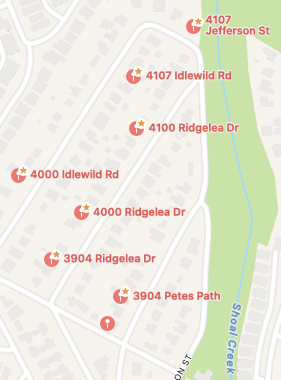

# 3904 Petes Path Valuation

_Updated: 2025-10-21_

## Summary

- **Comps reviewed:** 10 sales on Petes Path, Idlewild, Ridgelea, and Jefferson between Apr 2023 and Oct 2025.
- **Valuation Method A :** \$1,726,592 valuation @ \$574 \$/sqft.
- **Valuation Method B :** \$1,654,400 valuation @ \$550 \$/sqft.
- **Average:** **\$1.69M**

Prices are still falling, and adjusting past sales for the change in the market price index has a sizable impact. The same analysis without the price index adjustments gives - Method A: $1,795,776, Method B $1,774,720, Average: **\$1.79M**

## Neighborhood Sales

All homes sold on Petes Path, Idlewild, or Ridgelea since 2023.

{{tables/comps.md}}

---

## Valuation Method A — Indexed Price + Adjustments

Assumptions:

1. Assume last list price as the effective sale price (note true sale price is often lower).
2. Adjust for 78731 index change from sale date to present.
3. Add the following price adjustment to make the home more comparable to 3904 Petes Path:
   1. For homes > 20 years old, assume a rebuild at 3k sqft and with a cost of $900k
   2. For > 10 years old, add $200k renovation cost
   3. For high-end custom new build sales, add $500k premium
   4. For shoal creek lot, add $200k premium

{{tables/method-a.md}}

**Average adjusted \$/sqft:** \$574  
**Subject size:** 3,008 sqft  
**Method A valuation:** **\$1,726,592**

---

## Valuation Method B — Peer Group Average

Process:

1. Group comps by age and build quality.
2. Select Category B peers (same profile as 3904 Petes Path).
3. Apply ±10% quality adjustments before averaging $/sqft.

{{tables/method-b.md}}

**Average adjusted $/sqft:** $578  
**Subject size:** 3,008 sqft  
**Method B valuation:** **$1,654,400**
